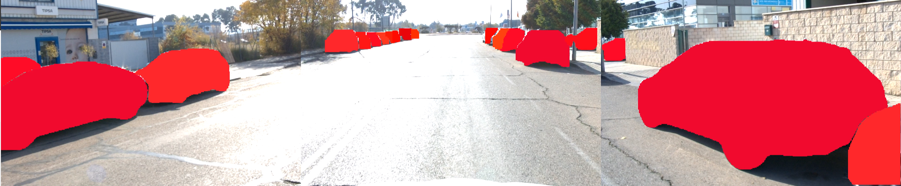

# YOLOv11 ROS 2 Node (Humble)

This repository provides a ROS 2 Humble integration of YOLOv11, for instantance Segmentation using Basler cameras and TensorRT acceleration. It includes camera drivers, segmentation nodes, and a metrics/logging node for performance analysis
and visualization.




## 📌 Origin

This work is derived from the original repository by `laugh12321`:  
➡️ https://github.com/laugh12321/TensorRT-YOLO/tree/main

The original code was adapted as a library so that a ROS 2 node could be easily created, allowing for seamless integration into robotic systems and ROS 2-based pipelines. The TensorRT-YOLO library is used by the `segment_node_3P` nodes to perform instance segmentation on images captured by Basler cameras. Therefore you can use it as a standalone script to run inference on images from a directory or from a camera.

##  General Architecture 

The system is composed of the following main nodes:

1. **Camera Node (`PylonCameraNode`)**
   - Captures real-time images from Basler cameras using the Pylon SDK.
   - Publishes images to ROS2 topics (e.g., `/camera_front_left/image_raw`, `/camera_front/image_raw`, `/camera_front_right/image_raw`).
   - Includes calibration and time synchronization information.

2. **Segmentation Nodes (`segment_node_3P`)**
   - One node per camera (e.g., `yolo_segment_node_left`, `yolo_segment_node_front`, `yolo_segment_node_right`).
   - Each node subscribes to its corresponding camera image topic.
   - Performs instance segmentation inference using TensorRT and a YOLO model.
   - Publishes results using the custom `InstanceSegmentationInfo` message to topics like `/segmentation/left/instance_info`.
   - Optionally, can save inference videos/masks and display real-time results.

3. **Subscriber & Metrics Node (`seg_sub`)**
   - Subscribes to the segmentation result topics from all three cameras.
   - Reconstructs instance masks from the received flat array.
   - Calculates latency metrics, packet loss, and camera synchronization.
   - Can save stitched videos and CSV logs with detailed statistics.

   ## Workspace Architecture Overview

Below is a diagram of the main packages and their interactions in this workspace:

```
+---------------------+         +--------------------------+         +-------------------+
| pylon_instant_camera|         |   TensorRT-YOLO          |         |      seg_sub      |
|  (camera drivers)   +-------->+  (segment_node_3P x3)    +-------->+ (metrics/logging) |
+---------------------+  image  +--------------------------+ result  +-------------------+
         |                             |      InstanceSegmentationInfo msg      ^
         |                             |                                        |
         |                             v                                        |
         |                    yolo_custom_interfaces (msg definitions)          |
         +---------------------------------------------------------------------+
```

### Relevant Packages

- **pylon_instant_camera-ros2/**  
  ROS2 node for Basler camera acquisition and publishing.

- **TensorRT-YOLO/**  
  Contains `segment_node_3P` nodes for each camera. Runs YOLO instance segmentation accelerated with TensorRT.

- **yolo_custom_interfaces/**  
  Defines the custom ROS2 message `InstanceSegmentationInfo` used for segmentation results.

- **seg_sub/**  
  Subscribes to segmentation results, reconstructs masks, computes metrics, and logs data.

- **image_directory_publisher/**  
  (Optional) Publishes images from a directory for testing or simulation.

---

## Custom Message: InstanceSegmentationInfo

The custom message used to communicate segmentation results is:

```plaintext
std_msgs/Header header
uint16 mask_width
uint16 mask_height
uint8[] mask_data
float32[] scores
uint8[] classes
builtin_interfaces/Time image_source_monotonic_capture_time
builtin_interfaces/Time processing_node_monotonic_entry_time
builtin_interfaces/Time processing_node_inference_start_time
builtin_interfaces/Time processing_node_inference_end_time
builtin_interfaces/Time processing_node_monotonic_publish_time
uint64 packet_sequence_number
```

- **mask_data**: Flat uint8 array, each element represents the instance ID of a pixel.
- **mask_width, mask_height**: Mask dimensions.
- **scores**: Confidence for each detected instance (`float32`, enough for 3 decimal places).
- **classes**: Class ID for each instance (`uint8`, up to 255 classes).
- **Timestamps**: Allow detailed latency and synchronization analysis.
- **packet_sequence_number**: For packet loss detection.

## Data Flow and Communication

1. **Image Capture**
   - The camera node publishes raw images to its topic.

2. **Inference and Publishing**
   - Each segmentation node receives images, runs inference, and generates:
     - An instance mask (flat array).
     - Lists of scores and classes.
     - Processing timestamps.
   - Publishes an `InstanceSegmentationInfo` message to its output topic.

3. **Subscription and Analysis**
   - The `seg_sub` node subscribes to all three result topics.
   - Reconstructs the mask using the `arrayToMat` function, colors the instances, and can stitch images from all cameras.
   - Calculates latency metrics (per stage and end-to-end), inter-camera spread, and packet loss.
   - Saves logs and videos for further analysis.

## Architecture Advantages

- **Scalability:** Easily add more cameras.
- **Synchronization:** Monotonic timestamps allow detailed latency and synchronization analysis.
- **Flexibility:** The custom message transports all relevant information for analysis and visualization.
- **Efficiency:** Flat arrays for masks reduce serialization/deserialization overhead.

## Requirements

- ROS2 Humble or newer
- OpenCV
- TensorRT (for inference nodes)
- Pylon SDK (for Basler cameras)

## Running

1. Launch the camera nodes.
2. Launch the segmentation nodes for each camera.
3. Launch the `seg_sub` node for analysis and logging.

See launch files and example scripts for configuration details.

---

**Contact:**  
For questions or suggestions, open an issue or contact the repository maintainer.