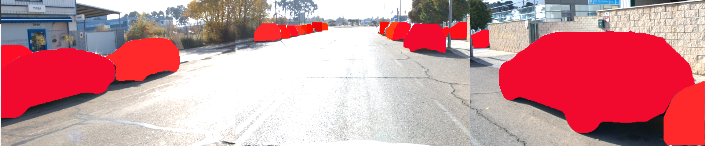

# YOLOv11 ROS 2 Node (Humble)

This repository provides a ROS 2 Humble integration of YOLOv11, for instantance Segmentation using Basler cameras and TensorRT acceleration. It includes camera drivers, segmentation nodes, and a metrics/logging node for performance analysis
and visualization.

<!--  -->

## 📌 Origin

This work is derived from the original repository by `laugh12321`:  
➡️ https://github.com/laugh12321/TensorRT-YOLO/tree/main

The original code was adapted as a library so that a ROS 2 node could be easily created, allowing for seamless integration into robotic systems and ROS 2-based pipelines. The TensorRT-YOLO library is used by the `segment_node_3P` nodes to perform instance segmentation on images captured by Basler cameras. Therefore you can use it as a standalone script to run inference on images from a directory or from a camera..

## Requirements

- ROS2 Humble
- OpenCV
- TensorRT (for inference nodes)

## Running

1. Launch the camera nodes.
2. Launch the segmentation nodes for each camera.
3. Launch the `seg_sub` node for analysis and logging.

See launch files and example scripts for configuration details.

---

**Contact:**  
For questions or suggestions, open an issue or contact the repository maintainer.
